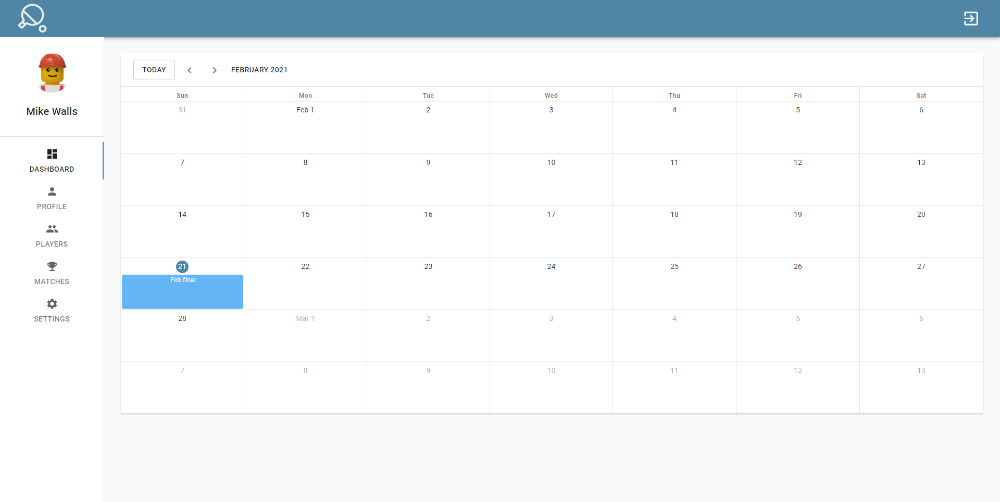
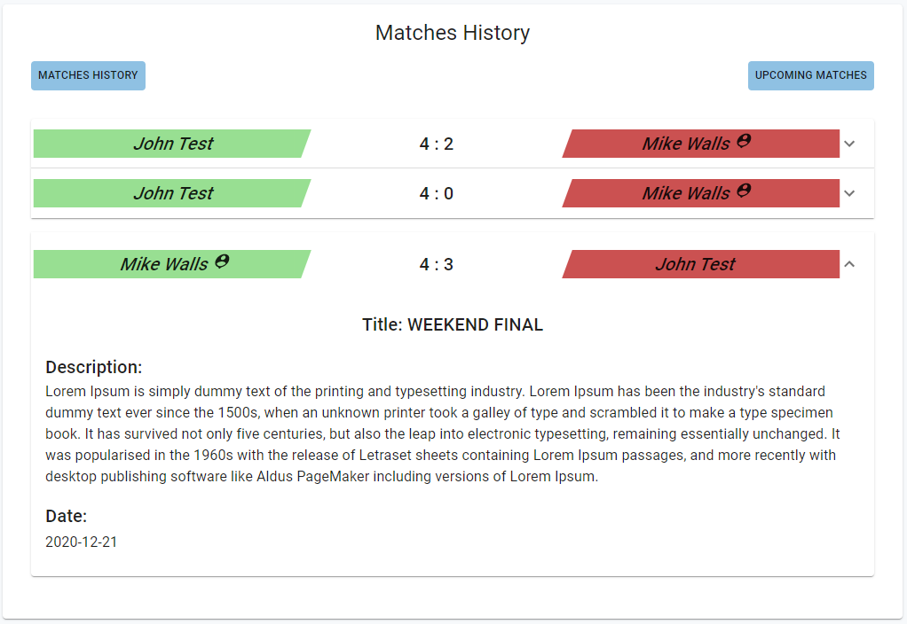
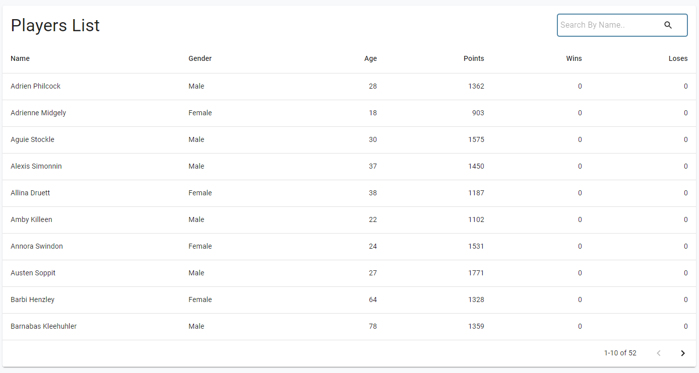
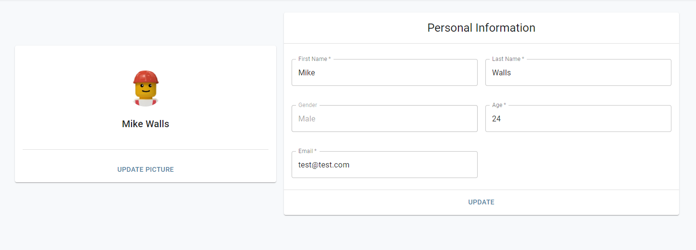

# SportManagement
SportManagement is an application for table tennis club to manage players and matches. 

## Description
There are Four main functions.
1. event scheduler
<p align="center">

<p>
2. View matches history and upcoming matches. 
<p align="center">

<p>
3. View and search players
<p align="center">

<p>
4. update profile
<p align="center">

<p>


##  Setup
Config a MongoDB
```bash
DATABASE=<your MongoDB database>
DATABASE_PASSWORD=<your MongoDB password>
```
#### Backend 
```bash
npm install
npm run dev
```
#### Frontend 
```bash
npm install
npm start
```
